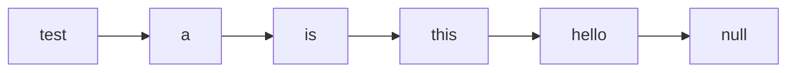

## OS-Project

This project was done in partial fulfillment of the requirements for the OS (ECEN-427) course at @Nile University.
## Tasks Progress:
- [x] Task 1 - Initial Utilities
    - [x] wcat
    - [x] wgrep
    - [x] wzip
    - [x] wunzip
- [x] Task 2 - Initial Reverse
- [X] Task 3 - Process Shell (Unix Shell)
- [x] Task 4 - Initial xv6 (getreadcount System Call)
- [x] Task 5 - Scheduling Algorithm (Lottery)
    - [x] settickets System Call
    - [x] getpinfo System Call
    - [x] Lottery Scheduling Algorithm Implementation

## Task 1: Initial Utilities:
**In the first task we were asked to make 4 different C tools:**
1. Wcat 
2. Wgrep
3. Wzip
4. Wunzip

To accomplish these tools, we made use of some c functions that handles files operations:
 - **fopen/fclose:** These 2 functions are used to open/close files through a file pointer.  
 - **getline:** Similar to fgets, which is used to read an entire line from a file, every time its invoked it reads the next line.
 	- **Note:** We opted to use getline instead of fgets to dynamically allocate the line buffer according to the length of each line in a file.
 - **getc:** Reads a character from a file, every time its invoked it reads the next character. 
 - **fwrite:** Used to write into a file.
 - **fread:** Used to read raw data from a file.
 - **free:** Used to free dynamically allocated memory, like for example the lines buffer. 
### wcat:
In this tool we were asked to make a simplified version of the cat command which is called wcat. Cat is a linux command that concatenates files together. However, in our version, wcat, we only need to read into the command line files specified by the user.

To accomplish this we used getline to read the lines of the given file/files and print it.
```
        char *buffer; // Buffer to store each line
        size_t len = 0; // Length of each line (will be dynamically changed by getline)
        while (getline(&buffer, &len, fp) != -1) { // Read line from file
            printf("%s", buffer); // Print line to stdout
        }
```
### wgrep:
In this tool we were asked to make something similar to the grep command which is called wgrep. This tool, wgrep, main function is to look for a keyword in the specified file/files given by the user and if it finds it the corresponding line will be printed.

To accomplish this we used the same logic we used in implementing the wcat tool, but instead of printing the contents of the file we used strstr function to check if the given keyword is a substring of the current line and if it is the corresponding line will be printed.
```
        char *buffer; // Buffer to store line
        size_t len = 0; // Length of line (will be dynamically changed by getline)
        while (getline(&buffer, &len, fp) != -1) {
            if (strstr(buffer, argv[1])) {
                printf("%s", buffer);
            }
        }
```

### wzip:
In this tool we were asked to make a file compression tool that uses a simple form of compression called run-length encoding which works by specifying the number of times a character bit has occurred next to each other. Wzip compresses the file/files into a specific binary format.
**Example:**
>aaaaaaaaaabbbb

**Is compressed into this:**
 >10a4b

To accomplish this the tool goes through several steps:
1. The tool starts by reading the given file/files and copy their contents into a temporary file. This temporary file is crucial since the user might give multiple files to compress, so we need to combine the contents of all the files into a single file.
```
    FILE *fp, *temp; // File pointers
    temp = tmpfile(); // Create temporary file
    for (int i = 1; i < argc; i++) {
        fp = fopen(argv[i], "r");
        if (fp == NULL) { // If file cannot be opened error handling
            printf("wzip: cannot open file\n");
            exit(1);
        }
        char *buffer; // Buffer to store line
        size_t len = 0; // Length of line (will be dynamically changed by getline)
        while (getline(&buffer, &len, fp) != -1) {
            fprintf(temp, "%s", buffer);
        }
        free(buffer); // Free buffer's allocated memory
        fclose(fp); // CLose file
    }
```
2. After copying the contents of the given files into the temp file, we need to rewind the temp file pointer to point at the start of the file since its currently pointing at the end.
```
    rewind(temp); // Set file pointer to beginning of file
```
3. To compress the file/files we will have a character counter which counts the number of times a character has occurred next to each other. Afterwards, we will read through a file character by character if the current character (ch) is the same as the character after it (next_ch) the counter will be incremented by 1. Furthermore, if the current character (ch) is not the same as the character after it (next_ch) the counter and the current character (ch) will be written into the default output stream stdout  with sizes 4 bytes (int) and 1 byte (char) respectively. This will continue until we have reach the end of file (EOF).
```
    int counter = 1; // Counter for consecutive characters
    char ch = (char) fgetc(temp), next_ch; // Get first character in file
    while (ch != EOF) { // Loop through file
        next_ch = (char) fgetc(temp); // Get next character
        if (next_ch == ch) {
            counter++; // If next character is same as current character increment counter
        } else {
            fwrite(&counter, sizeof(int), 1, stdout); // Write counter to stdout
            fwrite(&ch, sizeof(char), 1, stdout); // Write character to stdout
            counter = 1;
        }
        ch = next_ch; // Set current character to next character
    }
``` 
### wunzip:
In this tool we were asked to make a file decompression tool that decompresses compressed files similar to those created by the wzip tool.

To accomplish this, the tool goes through the given binary compressed file character by character. Firstly, we will use fread to read 4 bytes (int) which is the counter of a character and then use it to read 1 byte (char) which is the character that the counter corresponds to. Secondly, we will print this character counter times.

```
        while (fread(&counter, sizeof(int), 1, fp)) { // Read the number of characters
            fread(&ch, sizeof(char), 1, fp); // Read the character
            for (int j = 0; j < counter; j++) { // Print the character number of counter times
                printf("%c", ch);
            }
```

### Tool arguments and file considerations:
1. **Number of arguments**: 
	1. **Wcat**: Accepts 1 or more arguments, should be the path of text files.
	2. **Wgrep**: Accepts  1 or 2 arguments, the keyword and/or the file name (if the file name were not given the tool will instead read from stdin).
	3. **Wzip**: Accepts 1 or more arguments, the text files to be compressed.
	4. **Wunzip**: Accepts 1 or more arguments, the text files to be uncompressed.
	- **Note:** The number of arguments (argc) specified doesn't include the tool invocation name (ex: ./wcat). Additionally, if wrong number of arguments were given an error will be returned. 
2. **Invalid Files:** If either input/output files were given as arguments but for some reason they couldn't be opened an error will be returned.
### Task 1 Tests:

## Task 2: Initial Reverse:
In the second task we were asked to make a simple tool called "reverse". Reverse is a simple tool that reads a text file and prints out its content but in reverse order.

To accomplish this, we had to use a dynamic data structure that stores the contents of the file in a LIFO fashion, thus we used a linked list. We implemented a linked list such that whenever we insert a new line (node) it will be inserted at the beginning, which will become our new head. Furthermore, when we traverse through the linked list it will start from the head of the list till the tail of the list.

*Using test case 6 as an example:*
File contents:
> hello
> this
> is
> a
> test

To store these lines in our linked list we are going to use "readline()" inside a while loop to iterate over all the lines.
```
void createLLNodes(struct Node **head, FILE *fp) {
    char *buffer;
    size_t len;
    while (getline(&buffer, &len, fp) != -1) {
        struct Node *newNode = malloc(sizeof(struct Node));
        newNode->data = strdup(buffer);
        newNode->next = *head;
        *head = newNode;
    }
}
```

To traverse our list and print into our designated file, we will iterate normally from the head till the tail which will return them in the following order:
> test
 a
 is 
 this
 hello
```
void traverseLL(struct Node *head, FILE *fp) {
    struct Node *temp = head;
    while (temp != NULL) {
        if (temp->data) {
            fprintf(fp, "%s", temp->data);
        }
        temp = temp->next;
    }
}
```
### Tool arguments and file considerations:
 1. **Number of arguments**:  The tool only takes up to 2 arguments, if it takes more than 3 it will return an error. Moreover, if either input/output files were not given as an argument stdin/stdout will be used instead.
	- **Note:** The number of arguments (argc) specified doesn't include the tool invocation name (ex: ./reverse).
 2. **Input and Output files must be different**: The input and output files can't be same, to check for this we compared the files serial numbers using st_ino from the stat library, if they are the same an error will be returned.
 3. **Invalid Files:** If either input/output files were given as arguments but for some reason they couldn't be opened an error will be returned.
### Task 2 Tests:
## Task 3: Process Shell
In the third task we were asked to make a CLI/shell called wish. Wish is a simple shell, but somewhat similar to the one we use in unix/linux. The specifications were as follows:
 1. There are 2 modes to run in, interactive and batch. In the interactive mode, wish is invoked without any arguments "./wish" and runs repeatedly, until the user enters "exit", and prompts the user to enter their commands. In batch mode, wish is invoked with a single argument, a file that contains several commands that wish will execute.
 2. There will be 3 built-in commands exit, cd, and path. Exit command as the name suggests exits the shell and is invoked with 0 arguments "exit". CD command is used to change directories inside the search path of the shell and is invoked with 1 argument. Path command is used to replace the current search path of the shell with a new one and is invoked with at least 1 argument. 
 3. The user should be able to redirect the output of the shell to a file instead to the screen (STDOUT). This is possible  using output redirection(>), for example if the user inputs the following command "ls -la /tmp>output" the output is directed to the file "output" instead of the screan (STDOUT).
 4. The user should be able to run commands in parallel instead of serially. This is possible using the & operator, for example if the user inputs the following line "cmd1 & cmd2 args1 args 2 & cmd3 args1" the shell will execute cmd1, cmd, and cmd3 in parallel alongside their respective args.

To accomplish these specifications we built our shell in the following way:
 1. Firstly, if the shell is invoked with an argument the shell will open this file and read it line by line. Whenever the shell reads a line it parses it into an array of commands depending on if there are the parallel & operator or not, example if the line read consists of "cmd1 & cmd2 & cmd3" it will be parsed into {"cmd1","cmd2","cmd3"}.
 ```
 int parseInput(char *buffer, char *commands[]) {
    char *token, *rest = buffer;
    int i = 0;
    while ((token = strsep(&rest, "&")) != NULL) {
        if (token[0] != '\0') {
            commands[i] = malloc(strlen(token) + 1);
            strcpy(commands[i], token);
            i++;
        }
    }
    return i;
}
 ```
 2. Secondly, when the shell parses the input into an array of commands its going to iterate over the commands and execute each one.
```
                parseInput(buffer, commands);
                for (int i = 0; i < getArrayLength(commands); i++) {
                    executeCommand(commands[i]);
                }
```
3. In the executeCommand function, the shell will parse the given command into an array of tokens. Afterwards, the shell will check if the command is a built-in command or not. If the command is a built-in one it will call the corresponding built-in command. If the command is not a built in command the shell will check if it is located in its search path, if it doesn't find it it will return an error. Furthermore, if the shell finds the command in it will continue with executing it.
4. To continue to execute the command, the shell spawns in a child process for the command to be executed in using fork() and checks if redirection of the output is required by the command, if redirection is required it will check if its a valid redirection if its not a valid one it will return an error otherwise it will redirect the output to the corresponding file.
```
int hasRedirection(char *command[]) {
    int i = 0;
    while (command[i] != NULL) {
        if (strcmp(command[i], ">") == 0) {
            return i;
        }
        i++;
    }
    return -1;
}

// Check if the redirection is valid
bool checkRedirection(char *command[]) {
    int i = 0;
    while (command[i] != NULL) {
        if (strcmp(command[i], ">") == 0) {
            if (command[i + 1] == NULL || command[i + 2] != NULL || i == 0) {
                return false;
            }
        }
        i++;
    }
    return true;
}

// Redirect the output of the command to a file
void redirection(char *command[]) {
    int i = 0;
    while (command[i] != NULL) {
        if (strcmp(command[i], ">") == 0) {
            int fd = open(command[i + 1], O_WRONLY | O_CREAT | O_TRUNC);
            dup2(fd, STDOUT_FILENO);
            close(fd);
            command[i] = NULL;
            break;
        }
        i++;
    }
}
```
 1. After the shells finishes its check for redirection it will go on to execute the command in the child process by using execv. However, the parent process will not wait for it to finish if there are other commands to be executed in parallel. Therefore, the shell will repeat these steps for all parallel commands.
```
// Execute Commands
void executeCommand(char *commands) {
    char *tokens[100] = {NULL};
    parseCommands(commands, tokens);
    if (strcmp(tokens[0], "exit") == 0 || strcmp(tokens[0], "cd") == 0 || strcmp(tokens[0], "path") == 0) {
        builtInCommands(tokens);
        return;
    }
    char *path = checkPath(tokens[0]);
    if (path == NULL) {
        error();
        return;
    }
    int pid = fork();
    if (pid == 0) {
        if (hasRedirection(tokens) != -1) {
            if (checkRedirection(tokens) == true) {
                redirection(tokens);
            } else {
                error();
                exit(1);
            }
        }
        execv(path, tokens);
        error();
        exit(1);
    }
}
```
 2. After the shell starts the execution of all parallel commands, if any, it will then wait for all of them to finish before exiting, in case of batch mode.
```
            for (int i = 0; i < getArrayLength(commands); i++) {
                wait(NULL);
            }
```
### Task 3 Tests:

## Task 4: Initial xv6 (getreadcount System Call)
In the fourth task we were asked to implement a simple system call to the xv6 OS, getreadcount(). This system call returns a counter of how many times the read() system call was called by all processes since the kernel was booted. To implement it we are required to edit some files in xv6:
 1. user.h: Contains the function prototype to be used by user programs to invoke system calls. In here we will add our system call function prototype.
 2. usys.S: Contains an assembly routine that takes the called the system calls by the user programs and run the corresponding trap routine. In here we will add our system call.
 3. syscall.c: Contains an array of function pointers to all system calls and their function prototype. In here we will add our system call to the array and its function prototype.
 4. syscall.h: Contains the index of each system call in the array. In here we will add the index of our system call.
 5. sysfile.c: Contains the implementation of files related system calls, which includes the read system call. In here we will edit the read system call to increment the counter every time it is called.
 6. sysproc.c: Contains the implementation of process related system calls, which will also include our system call implementation. In here we will add the actual implementation of our system call alongside a counter linked to the counter defined in sysfile.c.
### Task 4 Tests:

## Task 5: Lottery Scheduling Algorithm
In the fifth task we were asked to implement a lottery scheduler in place of the current one in xv6. 

 1. Firstly, to implement thus scheduler we were asked to implement to
    system calls settickets(int) and getpinfo(struct pstat* ps) and to
    implement them is quite similar to the system we done in task 4,
    except that we used argint and argptr to pass values to our system
    calls. Furthermore, the implementation of the actual implementation
    of the system calls are in proc.c.
 2. Secondly, for the scheduler we must make sure of couple of things:
	 1.  **Assumption** A new process initially starts with 1 ticket.
	 2. The child process inherits the number of tickets from their parent.
3.  Thirdly, we needed a random number generator to generate a number from 1 to total number of tickets. Therefore, we used an altered version of the random number generator made by Takuji Nishimura and Makoto Matsumoto.
4. Finally, implementing the logic behind the lottery scheduler. Firstly, we will initialize 2 variables total-tickets and winner. Secondly, we will iterate over the process table and calculate the total number of tickets of runnable processes. Thirdly, we will generate a random number between 1 and the total number of tickets which will be our winning ticket. Fourthly, we will we will iterate through the process table and add the number of tickets to the counter and if the counter becomes greater than the winning ticket the process will be chosen to run.

### Task 5 Graph:
